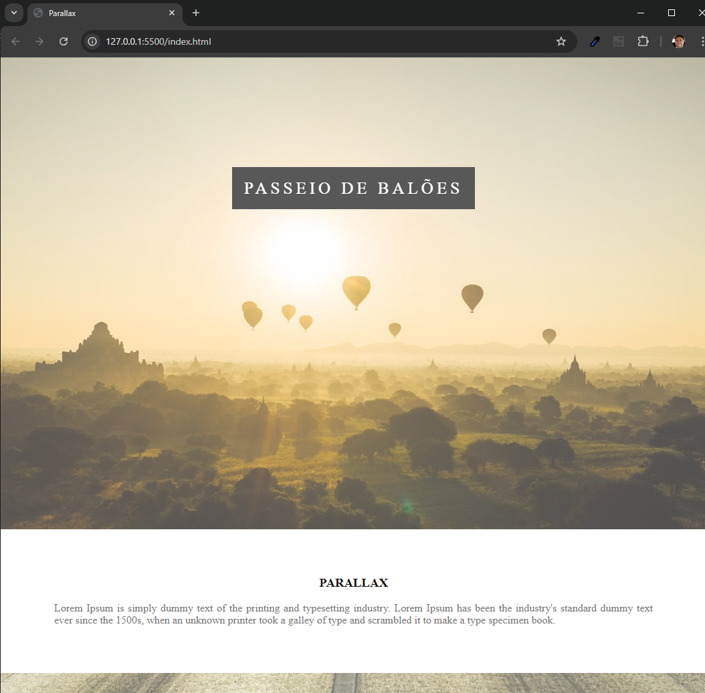

# Parallax

Curso online:

Domine Web - 20 Cursos - HTML5, CSS3, SASS, Bootstrap, JS, ES6, PHP, OO, MySQL, JQuery, MVC, APIs, IONIC e muito mais

Autores:
Jorge Sant Ana e Jamilton Damasceno

Módulo básico de HTML e CSS - Projeto básico de um site com efeito Parallax feito com css. 

>Figura 1: Parallax

 
